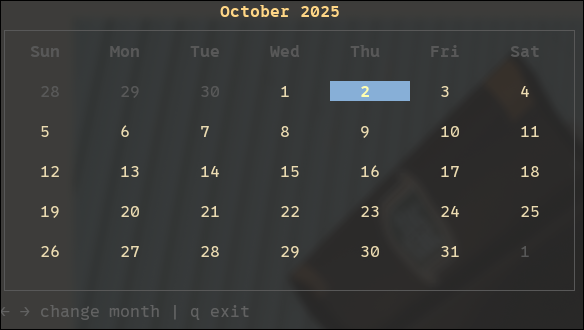

# Calendar CLI

A simple terminal-based calendar application built with Go, Cobra, and Bubble Tea.



> **Note**: This project is currently under active development.

## Features

- **Interactive Calendar View**: Display a month calendar directly in your terminal
- **Month Navigation**: Easily navigate between months using arrow keys
- **Current Day Highlighting**: The current day is automatically highlighted for quick reference
- **Clean UI**: Minimalist design
- **Keyboard Controls**: Simple keyboard shortcuts for navigation
- **CLI Framework**: Built with Cobra for extensibility

## Installation

```bash
go build -o calendar-cli
```

Or install directly:

```bash
go install github.com/jermartinz/calendar-cli@latest
```

## Usage

Run the calendar application:

```bash
./calendar-cli
```

You can also use it with Cobra commands:

```bash
calendar-cli --help
```

### Keyboard Shortcuts

- `←` (Left Arrow) - Go to previous month
- `→` (Right Arrow) - Go to next month
- `q` or `Ctrl+C` - Exit the application

## How It Works

The application displays a calendar for the current month by default. The current day is highlighted with a colored background. You can navigate through different months using the arrow keys. Days from adjacent months are shown in a dimmed color for context.

## Project Structure

```text
calendar-cli/
├── cmd/              # Cobra CLI commands
│   └── root.go       # Root command configuration
├── internal/
│   ├── calendar/     # Calendar generation logic
│   └── tui/          # Bubble Tea UI implementation
├── main.go           # Application entry point
└── README.md
```

## Technologies Used

- **[Go](https://go.dev/)**: Programming language
- **[Cobra](https://github.com/spf13/cobra)**: CLI framework for command-line interfaces
- **[Bubble Tea](https://github.com/charmbracelet/bubbletea)**: TUI framework for building terminal user interfaces
- **[Lipgloss](https://github.com/charmbracelet/lipgloss)**: Styling and layout for terminal output

## Requirements

- Go 1.21 or higher
- Terminal with color support

## License

See LICENSE file for details.
